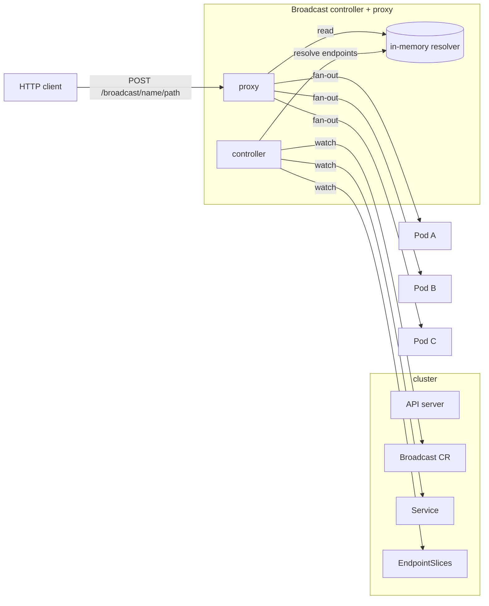

# goxang/broadcast

Best-effort HTTP broadcast primitive for Kubernetes.

`Broadcast` fans a **single HTTP request** out to **every ready endpoint** of a
Kubernetes Service:

```text
HTTP Client
    │
    ▼
Broadcast proxy
    │
    ├──── HTTP request ────► Pod A
    ├──── HTTP request ────► Pod B
    ├──── HTTP request ────► Pod C
    └──── HTTP request ────► Pod D
```

A normal Kubernetes `Service` load-balances each request to **one** endpoint.
A `Broadcast` sends it to **all** currently ready endpoints.

The intended use case is cache invalidation and similar event-hint /
optimization workloads: broadcast a "your cache is stale" hint to every replica
and let the application's own reconciliation (cache-miss, polling, TTL) handle
anything that was missed.

---

## Why not a normal Service?

A `Service` gives you exactly one backend per connection/request (round-robin or
session-affinity). There is no primitive in core Kubernetes that fans one
request out to every pod. The standard answer — "put Kafka/NATS/RabbitMQ in
front" — is a lot of infrastructure for a hint that is, by design, allowed to
be lost.

`Broadcast` fills the gap with a tiny, best-effort fan-out that is explicitly
*not* a messaging system.

---

## What "best effort" means

Delivery is intentionally UDP-like:

- No acknowledgement protocol.
- No delivery guarantee.
- No retry.
- No persistence.
- No ordering guarantee.
- No requirement that every pod receives the broadcast.
- A pod that joins after a broadcast does not receive it.
- A pod that is unavailable or terminating may miss it.
- The sender never learns which pods actually received it.
- A short, configurable timeout bounds the fan-out.

**Correctness of your application must not depend on broadcast delivery.** The
broadcast is an optimization; the source of truth lives elsewhere.

### This is NOT a messaging system

Do not use `Broadcast` as a replacement for Kafka, RabbitMQ, NATS, SQS, or any
queue/stream. There is no queue, no durable store, no ack, no redelivery, no
ordering, no consumer groups. If you need *reliable* delivery, use a real
messaging system. If you need a *cheap, fast, lossy hint*, use `Broadcast`.

---

## Architecture

Two cleanly separated packages in one small binary:



- **Controller** (`pkg/controller`): watches `Broadcast`, `Service`, and
  `EndpointSlice` objects via informers, resolves the current ready endpoint
  set, and writes it into an in-memory `resolver`. It also updates
  `Broadcast.status`.
- **Proxy** (`pkg/proxy`): an HTTP handler that reads the resolver and fans
  requests out. **The request path performs zero Kubernetes API calls.**

The two roles share one process for v1alpha1 (small, fast, simple). The
interface between them is `resolver.Resolver`, so they can be split into
separate deployments later without changing either side.

More detail in [docs/architecture.md](docs/architecture.md).

---

## Quick start

### 1. Install

```bash
helm install broadcast oci://ghcr.io/goxang/charts/broadcast \
  --namespace goxang-broadcast-system --create-namespace
```

Or with raw manifests (see `config/`):

```bash
kubectl apply -f config/crd/
kubectl create namespace goxang-broadcast-system
kubectl apply -f config/rbac/ -f config/manager/ -n goxang-broadcast-system
```

The controller and proxy are **single-namespace** in v1alpha1: they watch
`Broadcast`s in the namespace they are deployed to, and the proxy routes
`/broadcast/{name}/{path}` by looking up `{name}` in that same namespace.
Cluster-wide (multi-namespace) routing is not supported yet.

### 2. Create a Broadcast

```yaml
apiVersion: networking.goxang.io/v1alpha1
kind: Broadcast
metadata:
  name: cache-invalidation
spec:
  service:
    name: my-service
    targetPort: 8080
  protocol: HTTP
  timeout: 50ms
```

`spec.service` references an **existing** Service; the Broadcast never creates
or owns your Deployment.

### 3. Send a broadcast

```bash
curl -X POST http://broadcast.goxang-broadcast-system.svc:8080/broadcast/cache-invalidation/invalidate \
  -H 'Content-Type: application/json' \
  -d '{"key":"user:42"}'
```

The proxy forwards `POST /invalidate` (same method, headers, body, query) to
every ready endpoint of `my-service` on port `8080`.

Request forwarding: method, path, query string, body, and headers are preserved.
Hop-by-hop headers (`Connection`, `Keep-Alive`, `Transfer-Encoding`, `Upgrade`,
`Host`, etc.) are stripped, and the target sees its own `Host` header.

---

## API

```yaml
apiVersion: networking.goxang.io/v1alpha1
kind: Broadcast
spec:
  service:
    name: string       # existing Service name (same namespace)
    targetPort: integer # pod/endpoint port the targets listen on (NOT the Service port)
  protocol: HTTP      # only HTTP in v1alpha1 (default: HTTP)
  timeout: 1s         # fan-out budget (default: 1s)
  concurrency: 16     # max in-flight target requests (default: 16)
status:
  endpoints: 3        # ready endpoints currently resolved
  conditions:         # Ready=True when >=1 ready endpoint
    - type: Ready
      status: "True"
      reason: Ready
```

Printer columns: `SERVICE`, `TARGETPORT`, `TIMEOUT`, `ENDPOINTS`, `AGE`.

`spec.service.targetPort` is matched against the **EndpointSlice endpoint
port** (the pod port), exactly like a `Service`'s `targetPort`. It is *not* the
Service port, so it is unambiguous even when the Service maps its `port` to a
different `targetPort`. If the Service does not set a `targetPort` (i.e. it
defaults to the Service port), set this to the Service port number.

---

## Response semantics

The proxy is honest: it never pretends to guarantee delivery.

| Response | Meaning |
|----------|---------|
| `202 Accepted` | The broadcast was dispatched to ≥1 target. Body is a summary (targets, responses, errors, `timed_out`). Delivery to any given target is **not** guaranteed. |
| `400 Bad Request` | Malformed path. Expected `/broadcast/{name}[/{path}]`. |
| `404 Not Found` | No `Broadcast` with that name. |
| `413 Payload Too Large` | Request body exceeds the 1 MiB default limit. |
| `503 Service Unavailable` | `Broadcast` known but resolves to zero ready endpoints. |

A `202` is used because the proxy *accepts* the work but cannot *confirm* it was
delivered — that is the whole point. Individual target failures are folded into
the summary body and never fail the caller:

```json
{
  "broadcast": "cache-invalidation",
  "targets": 3,
  "dispatched": 3,
  "responses": 3,
  "errors": 0,
  "timed_out": false,
  "duration_ms": 4,
  "statuses": {"200": 3}
}
```

### Why the proxy waits (and what it does *not* mean)

The proxy dispatches to all eligible endpoints concurrently and then waits, at
most `spec.timeout`, for target responses before returning `202`. This short
wait exists **only to collect an honest summary**; it is *not* an acknowledgement
protocol:

- A `200` from a target is the target's **HTTP server** accepting the request.
  It is not an application-level acknowledgement, and it does not mean the
  target processed the message.
- If the budget expires, in-flight requests are cancelled, the result is
  reported as `timed_out`, and the caller still receives `202` (we dispatched;
  we do not know the rest).
- If a target never responds, the proxy does **not** retry and does **not** wait
  past the timeout.

So the caller's contract is simply: *"the proxy attempted to fan this out to the
eligible endpoints it knew about, within the timeout."* Nothing more.

---

## Failure behavior

- A failing/slow/unreachable target is isolated: other targets still receive
  the broadcast.
- No retries, ever.
- A `Broadcast` with zero ready endpoints returns `503` rather than hanging.
- Endpoint churn (scale up/down, pod restart) is picked up by the controller's
  informers within watch-latency, not on the request path.

---

## Scaling & performance

- Fan-out concurrency is bounded per Broadcast (`spec.concurrency`, default 16),
  so a large target set cannot spawn unbounded goroutines or connections.
- The proxy reuses a connection-pooled `http.Transport`
  (`MaxIdleConnsPerHost=8`), so steady-state broadcasts do not pay a TCP
  handshake per target.
- Controller CPU/memory is tiny (informer caches of a handful of objects). The
  proxy does a `RWMutex` read + N HTTP calls per broadcast.

A small in-cluster benchmark (1, 2, 3, 5, 10 tiny targets) is reproduced in
[docs/architecture.md](docs/architecture.md) with observed latency and resource
usage. This is a hint primitive, not a high-throughput bus — measure it against
*that* bar.

---

## Security model

- Least-privilege `Role`/`RoleBinding` scoped to the install namespace: the
  controller can `get/list/watch` `broadcasts`, `services`, `endpointslices`
  and `update/patch` `broadcasts/status` only.
- Non-root, read-only-root filesystem, `RuntimeDefault` seccomp, all
  capabilities dropped.
- The proxy binds only the pod's Service; it does not expose the API server.

---

## Resource requirements

Defaults: `requests: cpu=10m, memory=32Mi`, `limits: cpu=200m, memory=128Mi`.
The controller and proxy together are one process; a single small pod is enough
for most deployments.

---

## When NOT to use it

- You need guaranteed/at-least-once delivery → use a queue/stream.
- You need ordering → use a queue/stream.
- You need replay / persistence / DLQ → use a queue/stream.
- You need request/response semantics against all targets → this returns one
  summary, not N responses.
- Payloads are large → bodies are buffered and capped at 1 MiB.

Use it for: cache invalidation, configuration "refresh now" hints, local
index/derived-data invalidation, and similar fire-and-forget event hints.

---

## Development

```bash
make verify      # fmt + vet + test + race
make build       # static binary at bin/broadcast
make docker-build
make helm-lint
make e2e         # reproducible functional tests against a throwaway kind cluster
```

The unit tests (`go test ./...`) cover endpoint resolution, the resolver, the
proxy fan-out, timeout/concurrency bounds, and failure isolation. The
in-cluster functional suite (basic broadcast, scaling, pod removal, slow/failing
target, endpoint churn, Service independence) is automated by
`test/e2e/run.sh` and runs against a temporary `kind` cluster; see
[docs/architecture.md](docs/architecture.md).

## License

Apache-2.0. See [LICENSE](LICENSE).
